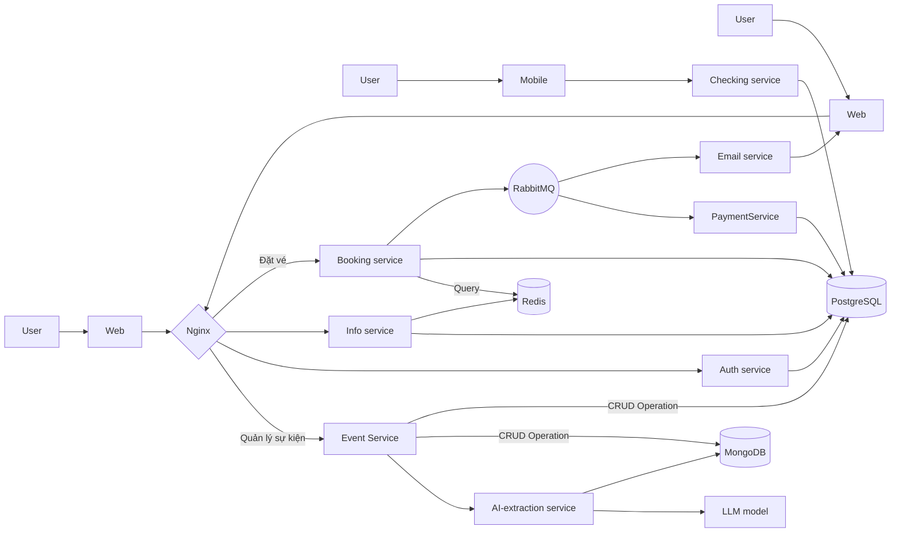
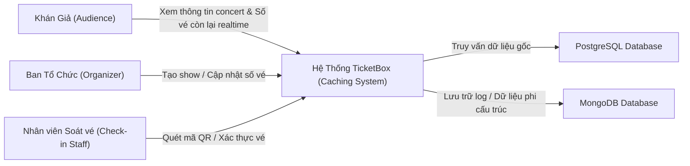
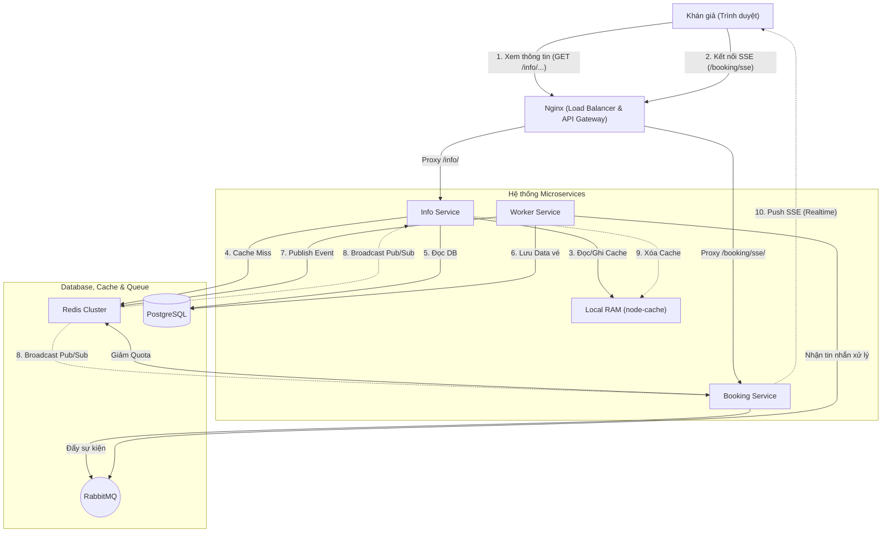
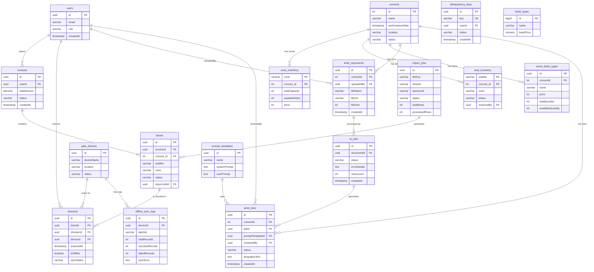
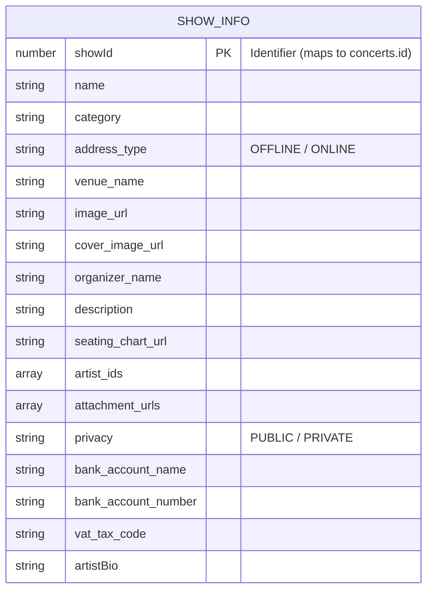

# TicketBox Caching — Technical Design

Tài liệu này đặc tả kiến trúc kỹ thuật của hệ thống Caching tối ưu thuộc dự án TicketBox, tập trung vào việc giải quyết bài toán tải cao (80.000 user concurrent) và đồng bộ số lượng vé thời gian thực dựa trên **Phương án 3: Hybrid Caching (Two-Tier Cache + SSE)**.

---

## 1. Kiến trúc tổng thể (Architectural Overview)
Dưới đây là sơ đồ kiến trúc tổng thể của hệ thống TicketBox, thể hiện luồng giao tiếp giữa người dùng, Gateway (Nginx), các Microservices, Message Broker và các Databases:

### Các thành phần tham gia:
1.  **Client (Browser):** Thiết lập kết nối SSE (`EventSource`) một chiều để nhận biến động số vé thời gian thực. Gửi các request đọc thông tin show thông thường qua HTTPS.
2.  **App Server (Node.js/Express Cluster):** Nơi xử lý logic. Mỗi instance chứa một vùng **Local In-Memory Cache (Tier 1)** độc lập.
3.  **Tier 1 (In-Memory Cache):** Nằm ngay trong bộ nhớ RAM của từng App Server (dùng thư viện `node-cache` hoặc map object). Giảm thiểu tối đa việc phải thực hiện các kết nối mạng (Network I/O) ra bên ngoài.
4.  **Tier 2 (Redis Cluster):** Tầng cache tập trung và có tính nhất quán cao hơn. Đóng vai trò là "Single Source of Truth" cho tầng Cache.
5.  **Redis Pub/Sub Channel:** Kênh truyền tin nội bộ để đồng bộ việc xóa/cập nhật cache giữa các App Server chạy song song.
6.  **Database (PostgreSQL):** Cơ sở dữ liệu gốc lưu trữ thông tin Concert và Ticket Types chính xác tuyệt đối.

---

## 2. C4 Diagram (Tập trung vào Caching)

### Level 1 — System Context
Thể hiện mối liên hệ giữa các tác nhân và hệ thống TicketBox liên quan đến chức năng xem thông tin/trạng thái vé.

### Level 2 — Container
Phân rã các thành phần bên trong hệ thống TicketBox phục vụ cho kiến trúc Caching.

---

## 3. Thiết kế Cơ sở dữ liệu (Polyglot Persistence Architecture)
Hệ thống áp dụng kiến trúc **Polyglot Persistence** phân chia dữ liệu trên 3 hệ thống khác nhau tùy theo đặc tính nghiệp vụ:

### 3.1. PostgreSQL (Relational Database)
Lưu trữ các dữ liệu cốt lõi yêu cầu tính nhất quán cao (ACID) như thông tin giao dịch, khóa chống trùng lặp, và trạng thái hệ thống:

*   **Bảng `concerts`**: Lưu thông tin tĩnh của show diễn. Dữ liệu này ít khi thay đổi nên sẽ được cache rất lâu.
*   **Bảng `zone_inventory`**: Quản lý sức chứa và số lượng vé trống của các khu vực chung (không có ghế ngồi cố định, ví dụ: VIP, Normal). Chứa cấu hình `ticketLimit` giới hạn mua.
*   **Bảng `seat_inventory`**: Quản lý từng ghế ngồi vật lý độc lập (Dùng cho hạng vé SVIP). Có cơ chế Lock giữ ghế bằng `expiryTime` và `reservedBy`.
*   **Bảng `invoices` & `tickets`**: Quản lý hóa đơn và vé thực tế xuất ra cho người dùng sau khi thanh toán.
*   **Bảng `idempotency_keys`**: Lưu khóa chống trùng lặp để ngăn ngừa lỗi thanh toán đúp (Double-charge) khi người dùng spam nút thanh toán.
*   **Bảng `import_jobs`**: Quản lý trạng thái tiến trình xử lý dữ liệu hàng loạt dưới background worker (ví dụ: Import VIP Guest từ file CSV).

### 3.2. MongoDB (Document Database)
Lưu trữ dữ liệu phi cấu trúc, linh hoạt về schema, phục vụ cho việc hiển thị, thông tin sự kiện đa phương tiện (CMS) mà không làm phình to DB giao dịch:

*   **Collection `ShowInfo`**: Quản lý toàn bộ thông tin mô tả chi tiết, hình ảnh, thông tin ban tổ chức, thông tin ngân hàng thanh toán và các thiết lập hiển thị của sự kiện. Schema có thể mở rộng dễ dàng các trường mới mà không cần migration phức tạp.

### 3.3. MinIO (S3-Compatible Object Storage)
Hệ thống lưu trữ File (Object Storage) phục vụ cho các luồng xử lý dữ liệu lớn và file tĩnh:
*   **ticketbox-csv-imports**: Bucket lưu trữ các file CSV định dạng danh sách khách mời VIP. File sau khi được upload an toàn sẽ kích hoạt `import_jobs` đọc stream trực tiếp từ MinIO về để Worker xử lý.
*   **ticketbox-assets**: Bucket lưu trữ các tài liệu tĩnh của sự kiện như hình ảnh cover, logo ban tổ chức, sơ đồ ghế, tài liệu cung cấp (PDF/Word) cho hệ thống AI phân tích (Summarization).

---

## 4. Thiết kế Kiểm soát Truy cập (Access Control Design)
Hệ thống sử dụng mô hình xác thực và phân quyền nhiều lớp, kết hợp giữa **Role-Based Access Control (RBAC)** và **Permission-based Access Control**, nhằm tối ưu hóa hiệu suất và bảo mật tại từng điểm chạm (Endpoint).

### 4.1. Mô hình Phân quyền và Các nhóm người dùng (Roles & Permissions)
Người dùng trong hệ thống được định danh thành 3 Role (vai trò) cơ bản:
*   **`USER` (Khán giả):** Không có quyền đặc biệt. Chỉ có thể thực hiện các luồng cơ bản như xem show, xếp hàng, chọn ghế và thanh toán (chỉ có quyền trên dữ liệu của chính mình).
*   **`CHECKIN_STAFF` (Nhân viên soát vé):** Quản lý quá trình check-in tại cổng sự kiện.
    *   Quyền sở hữu (Permissions): `CHECKIN_SCAN` (Quét mã vé), `CHECKIN_VIEW_HISTORY` (Xem lịch sử quét).
*   **`ORGANIZER` (Ban Tổ chức):** Quản lý toàn bộ sự kiện.
    *   Quyền sở hữu (Permissions): `AI_BIO_UPLOAD` (Upload tài liệu để AI xử lý), `CHECKIN_SCAN`, `CHECKIN_VIEW_HISTORY`, và toàn quyền thao tác với sự kiện của họ.

*(Lưu ý: Các Permission được ánh xạ linh hoạt (Dynamic Mapping) vào Role thông qua cấu hình mã nguồn để tránh việc phải liên tục query Database phân quyền, tối ưu hóa độ trễ API).*

### 4.2. Cách kiểm tra quyền tại từng điểm truy cập (Guards)
NestJS kết hợp Passport.js cung cấp các Guard (người gác cổng) để chặn và xác thực request tại tầng Middleware trước khi xử lý Logic:

1.  **`JwtAuthGuard` (Định danh chung):**
    *   Giải mã chuỗi JWT (JSON Web Token) trong header `Authorization: Bearer <token>`.
    *   Áp dụng rộng rãi ở toàn bộ các API Private (VD: Giữ ghế, Thanh toán, Lấy vé đã mua).

2.  **`PermissionsGuard` (Phân quyền sâu):**
    *   Kiểm tra Request đã qua JWT xem Role hiện tại có chứa danh sách `Permissions` bắt buộc cho API đó không (VD: API `/checkin/scan` yêu cầu `@Permissions('CHECKIN_SCAN')`).

3.  **`BookingPassGuard` (Giới hạn phiên đặt vé - Tầng Booking):**
    *   Bảo vệ API đặt chỗ (Booking).
    *   Kiểm tra sự tồn tại của **Giấy thông hành (Booking Pass)**: `booking_pass:{concertId}:{userId}` bên trong Redis.
    *   Chỉ những User đã vượt qua Phòng chờ (Waiting Room) và đang trong thời hạn cho phép (VD: 5 phút) mới được phép gọi API giữ ghế. Giúp ngăn chặn tuyệt đối tình trạng bypass Hàng đợi (Spam Request trực tiếp vào hệ thống Booking).

4.  **`RateLimitGuard` (Chống Spam/DDoS):**
    *   Theo dõi và giới hạn số lượng Request/giây của từng IP hoặc User tại các điểm nóng dễ bị tấn công (như API Chọn ghế, API Thanh toán).

---

## 5. Thiết kế các cơ chế bảo vệ hệ thống (System Protection Mechanisms)

### 5.1. Kiểm soát tải đột biến (Surge Load Control)
*   **Giải pháp & Thuật toán:** Sử dụng mô hình **Virtual Waiting Room (Phòng chờ ảo)** kết hợp **RateLimitGuard**.
*   **Ngưỡng kích hoạt:** Khi số lượng request (CCU - Concurrent Users) truy cập mua vé tăng vọt, hoặc vượt quá ngưỡng quy định (VD: 100 req/phút/IP).
*   **Hành vi khi vượt ngưỡng:**
    *   Người dùng được điều hướng vào hàng đợi (Waiting Room).
    *   Hệ thống cấp phát Token (Booking Pass) dần dần cho người dùng. Chỉ có Booking Pass hợp lệ mới đi qua được `BookingPassGuard` để gọi API Giữ ghế.
    *   Ngăn chặn 99% lượng truy cập tràn trực tiếp vào Database, chống sập (DDoS) nội bộ hoàn toàn.

### 5.2. Xử lý cổng thanh toán không ổn định (Unstable Payment Gateway)
*   **Giải pháp:** Mọi giao dịch gọi sang Đối tác thanh toán (PayPal, VNPay) đều được xử lý bất đồng bộ bằng **Webhook** và kiến trúc hướng sự kiện (Event-driven qua RabbitMQ) thay vì chờ đợi đồng bộ.
*   **Các trạng thái & Ngưỡng kích hoạt:**
    *   Áp dụng mô hình **Circuit Breaker** (nếu có dấu hiệu chập chờn từ API thứ 3). 
    *   Ngưỡng: Tỷ lệ lỗi (Timeout/502) vượt quá % thiết lập trong thời gian ngắn.
*   **Hành vi khi lỗi:** Hệ thống chỉ tạm giữ ghế (giỏ hàng trạng thái `PENDING` trong `idempotency_keys`) và sinh lỗi trả về frontend. Nếu Webhook từ cổng thanh toán báo trễ, RabbitMQ Worker vẫn sẽ âm thầm nhận ở chế độ nền và khớp lệnh thanh toán thành công, không bắt người dùng treo máy chờ đợi màn hình loading.

### 5.3. Chống trừ tiền hai lần (Double-charge Prevention)
*   **Cơ chế:** Áp dụng **Idempotency Key (Khóa lũy đẳng)** với thiết kế 3 lớp kiểm tra khắt khe.
*   **Nơi lưu trữ & TTL:**
    *   **Lớp 1 (Fast-check):** Cache `idem:{key}` tại **Redis** với TTL = 24 giờ (86400s). Từ chối request trùng lặp cực nhanh không tốn I/O DB.
    *   **Lớp 2 (ACID Guarantee):** Bảng `idempotency_keys` trên **PostgreSQL** với Constraint `UNIQUE(key)`. Chống Race-condition (nếu 2 request vượt qua Redis cùng 1 mili-giây, lệnh `INSERT` DB sẽ văng lỗi `23505 Unique Violation`).
*   **Luồng xử lý:** Khi Webhook thanh toán bắn 2 lần hoặc User bấm F5 liên tục gọi API `Capture`, hệ thống tìm thấy Key đã dùng -> Log cảnh báo `Duplicate capture request` -> Trả luôn kết quả thành công cũ (Cached Response Payload) chứ tuyệt đối không thực hiện trừ tiền lại.

### 5.4. Caching (Tối ưu truy xuất & Chống quá tải DB)
Hệ thống kết hợp **Hybrid Cache (Two-Tier)**:
*   **Đối tượng cần Cache & TTL:**
    *   **Thông tin Concert tĩnh:** Cache tại Local RAM (Tầng 1). TTL = 5 phút (300s).
    *   **Số lượng vé/ghế (Dữ liệu cực nóng):** Local RAM (TTL = 1 giây) & Redis tập trung (Vô hạn, tới khi hết show).
*   **Chiến lược:** Sử dụng **Cache-Aside** cho việc đọc, và **Write-Through** khi đặt vé (giữ ghế luôn trừ trực tiếp lên Redis bằng lệnh `HINCRBY` / `HSETNX`).
*   **Cách Invalidate (Pub/Sub):** Khi vé được thanh toán xong ở Worker, Worker đẩy Invalidation Message qua Redis Pub/Sub. Các App Server bắt được tín hiệu sẽ lập tức xóa Local Cache cũ và đẩy trạng thái ghế mới xuống Browser qua đường ống **SSE (Server-Sent Events)** thời gian thực (không phải chờ hết 1s TTL).

## 6. Các Quyết định Kỹ thuật Quan trọng (ADR)

### ADR-01: Lựa chọn Server-Sent Events (SSE) vs WebSockets
*   **Quyết định:** Sử dụng SSE.
*   **Lý do:** Yêu cầu nghiệp vụ của hệ thống Booking là luồng **Một chiều (Server push to Client)** để báo ghế bị mua. SSE chạy trên HTTP tiêu chuẩn, nhẹ hơn, dễ đi qua Nginx Load Balancer, hỗ trợ auto-reconnect, chịu tải hàng chục ngàn kết nối tốt hơn WebSockets (vốn dành cho luồng Hai chiều - Bi-directional).
*   **Đánh đổi:** Khách hàng không thể gửi dữ liệu ngược lại Server qua cùng 1 đường ống (phải dùng HTTP Request riêng). Bị giới hạn số lượng kết nối tối đa trên mỗi trình duyệt nếu dùng HTTP/1.1 (phải ép cấu hình hạ tầng chạy HTTP/2 để khắc phục).

### ADR-02: Lựa chọn SQL (PostgreSQL) vs NoSQL (MongoDB)
*   **Quyết định:** Kết hợp cả hai (Polyglot Persistence).
*   **Lý do:** 
    *   Hệ thống Đặt vé & Thanh toán yêu cầu tính toàn vẹn dữ liệu cực kỳ khắt khe (ACID, Transaction, Foreign Keys) để không mất tiền/vé -> Bắt buộc dùng SQL (PostgreSQL).
    *   Thông tin sự kiện, Bio nghệ sĩ, nội dung AI sinh ra lại rất phi cấu trúc, dễ biến động -> Dùng NoSQL (MongoDB) làm Document Store linh hoạt.
*   **Đánh đổi:** Hệ thống phức tạp hơn, bảo trì và Backup đắt đỏ hơn vì phải vận hành 2 database engine riêng biệt.

### ADR-03: Lựa chọn JWT vs Session cho Authentication
*   **Quyết định:** Sử dụng JWT (JSON Web Token) Stateless.
*   **Lý do:** Thiết kế Microservices cần scale-out dễ dàng. Nếu dùng Session, ta phải tra cứu Redis mỗi khi user request. Dùng JWT, bản thân mỗi App Server tự Verify Token mà không tốn chi phí Network Call, giúp Throughput hệ thống cực kỳ cao.
*   **Đánh đổi:** Không thể thu hồi quyền ngay lập tức nếu lộ Token (cần giải quyết bằng Access Token sống ngắn + Refresh Token).

### ADR-04: Lựa chọn RabbitMQ vs Kafka cho Message Broker
*   **Quyết định:** Sử dụng RabbitMQ.
*   **Lý do:** RabbitMQ cung cấp cơ chế định tuyến (Routing) linh hoạt thông qua Exchanges và tích hợp sẵn Dead Letter Queue (DLQ), đặc biệt phù hợp với các tác vụ yêu cầu cơ chế xử lý lỗi và Retry phức tạp (như xử lý Webhook thanh toán, gửi Email). Hơn nữa, mức thông lượng (Throughput) dự kiến của hệ thống (dưới 10.000 messages/giây) hoàn toàn nằm trong giới hạn tối ưu của RabbitMQ, giúp giảm thiểu độ phức tạp trong việc triển khai và tiết kiệm chi phí quản trị (Operational Overhead) so với kiến trúc của Kafka.
*   **Đánh đổi:** Không hỗ trợ mô hình lưu trữ dạng chuỗi sự kiện bền vững (Log-based / Event Sourcing) và thiếu vắng khả năng tái xử lý (Replay) dữ liệu lịch sử ở quy mô lớn như Kafka.

### ADR-05: Optimistic vs Pessimistic Locking cho Giữ Ghế
*   **Quyết định:** Sử dụng Pessimistic Locking kết hợp Redis chốt chặn từ bên ngoài.
*   **Lý do:** Với show HOT (tỷ lệ chọi 1/100), nếu dùng Optimistic Locking (dựa vào version row DB), 99 user sẽ bị văng lỗi ở giây cuối cùng sau khi cất công điền form, trải nghiệm vô cùng tệ. Ta dùng lệnh `HSETNX` của Redis (chỉ 1 người chèn key thành công) để khóa cứng ghế ngay ở bộ nhớ đệm (Pessimistic fail-fast), 99 người đến sau lập tức nhận thông báo ghế đã có người giữ.
*   **Đánh đổi:** Cần xử lý cẩn thận TTL của lệnh khóa và fallback nhả khóa (Release Lock) nếu thanh toán rớt để ghế được nhả ra lại.
