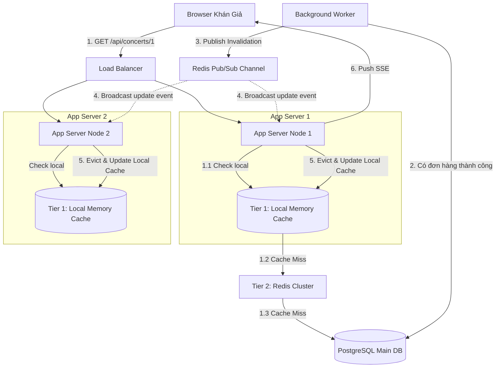
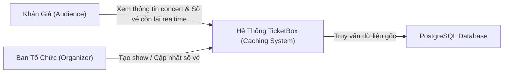
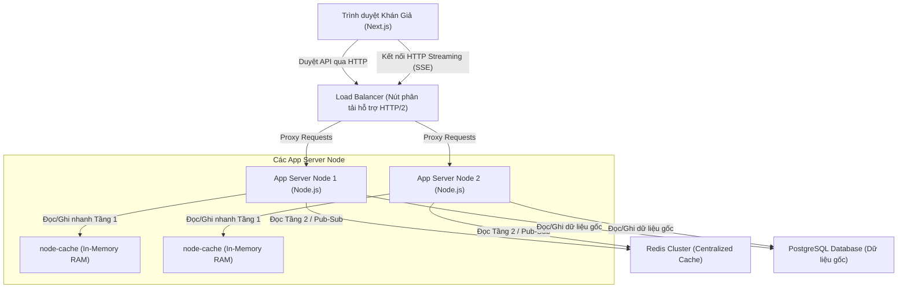
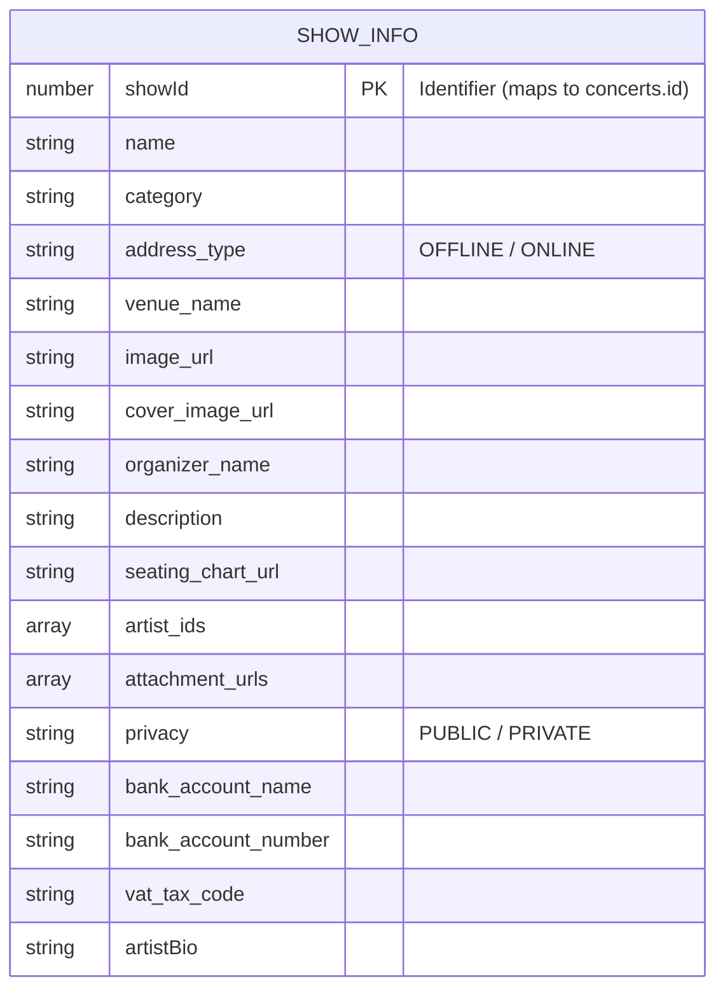

# TicketBox Caching — Technical Design

Tài liệu này đặc tả kiến trúc kỹ thuật của hệ thống Caching tối ưu thuộc dự án TicketBox, tập trung vào việc giải quyết bài toán tải cao (80.000 user concurrent) và đồng bộ số lượng vé thời gian thực dựa trên **Phương án 3: Hybrid Caching (Two-Tier Cache + SSE)**.

---

## 1. Kiến trúc tổng thể (Architectural Overview)
Kiến trúc Caching của TicketBox được thiết kế theo mô hình **Cache Phân Tầng (Two-Tier Cache)** kết hợp với cơ chế **Đẩy dữ liệu chủ động (Server-Sent Events - SSE)** để đảm bảo khả năng chịu tải cực cao và tính nhất quán dữ liệu ở thời gian thực.



### Các thành phần tham gia:
1.  **Client (Browser):** Thiết lập kết nối SSE (`EventSource`) một chiều để nhận biến động số vé thời gian thực. Gửi các request đọc thông tin show thông thường qua HTTPS.
2.  **App Server (Node.js/Express Cluster):** Nơi xử lý logic. Mỗi instance chứa một vùng **Local In-Memory Cache (Tier 1)** độc lập.
3.  **Tier 1 (In-Memory Cache):** Nằm ngay trong bộ nhớ RAM của từng App Server (dùng thư viện `node-cache` hoặc map object). Giảm thiểu tối đa việc phải thực hiện các kết nối mạng (Network I/O) ra bên ngoài.
4.  **Tier 2 (Redis Cluster):** Tầng cache tập trung và có tính nhất quán cao hơn. Đóng vai trò là "Single Source of Truth" cho tầng Cache.
5.  **Redis Pub/Sub Channel:** Kênh truyền tin nội bộ để đồng bộ việc xóa/cập nhật cache giữa các App Server chạy song song.
6.  **Database (PostgreSQL):** Cơ sở dữ liệu gốc lưu trữ thông tin Concert và Ticket Types chính xác tuyệt đối.

---

## 2. C4 Diagram (Tập trung vào Caching)

### Level 1 — System Context
Thể hiện mối liên hệ giữa các tác nhân và hệ thống TicketBox liên quan đến chức năng xem thông tin/trạng thái vé.



### Level 2 — Container
Phân rã các thành phần bên trong hệ thống TicketBox phục vụ cho kiến trúc Caching.



---

## 3. Thiết kế Cơ sở dữ liệu (Polyglot Persistence Architecture)
Hệ thống áp dụng kiến trúc **Polyglot Persistence** phân chia dữ liệu trên 3 hệ thống khác nhau tùy theo đặc tính nghiệp vụ:

### 3.1. PostgreSQL (Relational Database)
Lưu trữ các dữ liệu cốt lõi yêu cầu tính nhất quán cao (ACID) như thông tin giao dịch, khóa chống trùng lặp, và trạng thái hệ thống:

```mermaid
erDiagram
    users ||--o{ invoices : "has"
    users ||--o{ seat_inventory : "holds/books"
    concerts ||--o{ zone_inventory : "has zones"
    concerts ||--o{ seat_inventory : "has seats"
    invoices ||--|{ tickets : "contains"
    import_jobs ||--o{ concerts : "belongs to"

    users {
        uuid id PK
        varchar email
        varchar passwordHash
        timestamp createdAt
    }
    concerts {
        int id PK
        varchar name
        timestamp performanceDate
        varchar location
        varchar status
    }
    zone_inventory {
        varchar zone PK
        int concert_id PK
        int totalCapacity
        int availableSlots
        int price
        int ticketLimit
    }
    seat_inventory {
        varchar seatNo PK
        int concert_id PK
        varchar zone
        varchar status "AVAILABLE, RESERVED, BOOKED"
        uuid reservedBy FK
        timestamp expiryTime
    }
    invoices {
        uuid id PK
        uuid userId FK
        int concert_id FK
        decimal totalAmount
        varchar status
        timestamp createdAt
    }
    tickets {
        uuid id PK
        uuid invoiceId FK
        int concert_id FK
        varchar seatNo FK
        varchar zone FK
        decimal price
        varchar qrCodeUrl
    }
    idempotency_keys {
        uuid id PK
        varchar key UK
        uuid userId FK
        varchar status
        int concert_id FK
        jsonb requestPayload
        jsonb responsePayload
        varchar paypalOrderId
        timestamp createdAt
        timestamp expiresAt
    }
    import_jobs {
        uuid id PK
        varchar fileKey
        varchar showId
        varchar sponsorId
        varchar status
        int totalRows
        int processedRows
    }
```



*   **Bảng `concerts`**: Lưu thông tin tĩnh của show diễn. Dữ liệu này ít khi thay đổi nên sẽ được cache rất lâu.
*   **Bảng `zone_inventory`**: Quản lý sức chứa và số lượng vé trống của các khu vực chung (không có ghế ngồi cố định, ví dụ: VIP, Normal). Chứa cấu hình `ticketLimit` giới hạn mua.
*   **Bảng `seat_inventory`**: Quản lý từng ghế ngồi vật lý độc lập (Dùng cho hạng vé SVIP). Có cơ chế Lock giữ ghế bằng `expiryTime` và `reservedBy`.
*   **Bảng `invoices` & `tickets`**: Quản lý hóa đơn và vé thực tế xuất ra cho người dùng sau khi thanh toán.
*   **Bảng `idempotency_keys`**: Lưu khóa chống trùng lặp để ngăn ngừa lỗi thanh toán đúp (Double-charge) khi người dùng spam nút thanh toán.
*   **Bảng `import_jobs`**: Quản lý trạng thái tiến trình xử lý dữ liệu hàng loạt dưới background worker (ví dụ: Import VIP Guest từ file CSV).

### 3.2. MongoDB (Document Database)
Lưu trữ dữ liệu phi cấu trúc, linh hoạt về schema, phục vụ cho việc hiển thị, thông tin sự kiện đa phương tiện (CMS) mà không làm phình to DB giao dịch:


*   **Collection `ShowInfo`**: Quản lý toàn bộ thông tin mô tả chi tiết, hình ảnh, thông tin ban tổ chức, thông tin ngân hàng thanh toán và các thiết lập hiển thị của sự kiện. Schema có thể mở rộng dễ dàng các trường mới mà không cần migration phức tạp.

### 3.3. MinIO (S3-Compatible Object Storage)
Hệ thống lưu trữ File (Object Storage) phục vụ cho các luồng xử lý dữ liệu lớn và file tĩnh:
*   **ticketbox-csv-imports**: Bucket lưu trữ các file CSV định dạng danh sách khách mời VIP. File sau khi được upload an toàn sẽ kích hoạt `import_jobs` đọc stream trực tiếp từ MinIO về để Worker xử lý.
*   **ticketbox-assets**: Bucket lưu trữ các tài liệu tĩnh của sự kiện như hình ảnh cover, logo ban tổ chức, sơ đồ ghế, tài liệu cung cấp (PDF/Word) cho hệ thống AI phân tích (Summarization).

---

## 4. Thiết kế Kỹ thuật Chi tiết: Hybrid Caching (Two-Tier)
Hệ thống kết hợp 2 tầng cache để tối ưu hóa hiệu năng:

### Tầng 1: Local In-Memory Cache (RAM cục bộ tại mỗi App Node)
*   **Công nghệ:** Sử dụng thư viện `node-cache` (đối với Node.js) chạy trực tiếp trong RAM của tiến trình.
*   **Chính sách TTL (Time-To-Live):**
    *   Thông tin Concert tĩnh: **TTL = 5 phút** (300 giây).
    *   Số lượng vé còn lại: **TTL = 1 giây**.
*   **Ý nghĩa:** Khi 80.000 user cùng F5 hoặc kết nối liên tục, thay vì 80.000 request đập vào Redis, mỗi App Server chỉ gửi tối đa **1 request/giây** đến Redis để cập nhật lại số lượng vé. Nếu có 30 App Server, Redis Cluster chỉ phải chịu **30 req/s** - một tải trọng cực kỳ nhẹ nhàng.

### Tầng 2: Centralized Cache (Redis Cluster tập trung)
*   **Công nghệ:** Redis Cluster đảm bảo phân tán dữ liệu và tính sẵn sàng cao.
*   **Quy ước Key:**
    *   Thông tin Concert: `concert:{concert_id}:info` (TTL = 1 giờ).
    *   Số lượng vé khu vực tự do: `concert:{concert_id}:inventory` (Hash key lưu `{zone}: {availableSlots}`).
    *   Trạng thái ghế ngồi SVIP: `concert:{concert_id}:seats` (Hash key lưu `{seatNo}: {userId}` để giữ chỗ bằng lệnh `HSETNX`). Không đặt TTL (vô hạn) vì Redis đóng vai trò là chốt chặn chống Double-booking trong thời gian thực.

### Cơ chế Invalidation & Push thời gian thực (Redis Pub/Sub + SSE)
Khi có giao dịch mua vé thành công, hệ thống không đợi 1 giây TTL của Local Cache hết hạn mà thực hiện đồng bộ chủ động:

```
[KHÁCH HÀNG BẤM THANH TOÁN (CHECKOUT)]
       │
       ▼
1. Lưu giỏ hàng: Backend chèn 1 dòng `PENDING` kèm `requestPayload` vào bảng `idempotency_keys` trên PostgreSQL để khóa giao dịch chống đúp (Double-charge).
       │
       ▼
2. Giữ vé tạm thời: Thực hiện trừ số vé trên RAM Redis Cluster bằng lệnh `HINCRBY` (cho Zone) hoặc `HSETNX` (cho Seat). Trả link PayPal cho khách đi thanh toán.
       │
       ▼
[PAYPAL BÁO THANH TOÁN THÀNH CÔNG BẰNG WEBHOOK]
       │
       ▼
3. Đẩy tin nhắn Webhook vào Message Queue (RabbitMQ) và trả phản hồi ngay cho PayPal.
       │
       ▼
4. Background Worker (Chạy ngầm) bốc tin nhắn từ Queue ra xử lý:
   ├── Đọc PostgreSQL: Kéo giỏ hàng từ bảng `idempotency_keys` ra.
   └── Ghi PostgreSQL: Lưu dữ liệu gốc vào các bảng `invoices`, `tickets`. Cập nhật trạng thái ghế sang `BOOKED` tại `seat_inventory` và trừ `availableSlots` tại `zone_inventory`.
       │
       ▼
5. Worker phát một message lên kênh Redis Pub/Sub: `{"concert_id": 1, "zone": "VIP", "availableSlots": 198}` hoặc `{"seatNo": "A-1", "status": "BOOKED"}`.
       │
       ▼
6. Tất cả các App Server Node đăng ký kênh này lập tức nhận được message:
   ├── Xóa trạng thái ghế/vé cũ trong RAM cục bộ (Local Cache Tầng 1).
   └── Ghi đè trạng thái mới nhất vào Local Cache.
       │
       ▼
7. Các App Server chủ động đẩy (push) sự thay đổi này xuống trình duyệt của khách hàng 
   đang xem show qua đường ống SSE (Server-Sent Events) đang duy trì.
       │
       ▼
8. Trình duyệt nhận sự kiện và cập nhật trực tiếp lên UI (Ví dụ: Ghế A-1 đột nhiên chuyển sang màu xám).
```

---

## 5. Phân tích các Kịch bản Lỗi (Resilience Design)

### Kịch bản 1: Redis Cluster trung tâm bị mất kết nối (Redis Down)
*   **Ảnh hưởng:** Không thể lấy dữ liệu từ Tầng 2, nguy cơ gây sập PostgreSQL do toàn bộ App Server quay về đọc DB gốc.
*   **Giải pháp xử lý (Fallback):**
    *   Khi phát hiện lỗi kết nối Redis, App Server tự động kích hoạt **Graceful Degradation**.
    *   Tự động tăng TTL của Local Cache (Tầng 1) đối với số lượng vé từ **1 giây lên 10 giây**.
    *   Trong 10 giây này, tất cả user kết nối tới App Node đó đều đọc dữ liệu cũ lưu trong RAM cục bộ. Hệ thống chấp nhận dữ liệu hiển thị bị trễ 10 giây nhưng **tuyệt đối không để DB bị quá tải**.
    *   Ghi log cảnh báo mức CRITICAL để quản trị viên can thiệp hệ thống Redis.

### Kịch bản 2: Đường truyền mạng nội bộ bị lag khiến tin nhắn Pub/Sub bị mất
*   **Ảnh hưởng:** Một hoặc một vài App Server không nhận được lệnh xóa Local Cache, dẫn đến hiển thị số vé bị lệch (Stale Data) quá 1 giây.
*   **Giải pháp xử lý:** Nhờ cơ chế TTL cứng của Tầng 1 là **1 giây**, ngay cả khi không nhận được Pub/Sub message, Local Cache cục bộ của App Node đó cũng sẽ tự hết hạn sau tối đa 1 giây. Khi đó, request tiếp theo sẽ chủ động gọi lên Redis lấy số lượng mới nhất. Lệch dữ liệu tối đa chỉ giới hạn trong **1 giây**.

### Kịch bản 3: Kết nối SSE của Client bị ngắt đột ngột
*   **Ảnh hưởng:** Khán giả không nhận được cập nhật nhảy số realtime nữa.
*   **Giải pháp xử lý:** Phía Client cấu hình tự động reconnect với cơ chế **Exponential Backoff**. Khi kết nối lại thành công, client thực hiện gọi API `GET /api/concerts/1` một lần để đồng bộ lại trạng thái vé mới nhất.

---

## 6. Các Quyết định Kiến trúc Quan trọng (ADR)

### ADR-01: Lựa chọn Server-Sent Events (SSE) thay vì WebSockets để cập nhật realtime
*   **Quyết định:** Sử dụng SSE (HTTP Streaming) thay thế cho WebSockets để đẩy số lượng vé còn lại xuống Browser.
*   **Lý do:** 
    *   Yêu cầu nghiệp vụ ở đây là **một chiều (unidirectional)**: chỉ cần Server đẩy số lượng vé biến động xuống cho client xem. Client không cần gửi dữ liệu ngược lại.
    *   SSE chạy trên giao thức HTTP tiêu chuẩn, tự động hỗ trợ cơ chế Reconnect, dễ dàng cấu hình qua Nginx Load Balancer hơn WebSockets.
    *   Độ phức tạp lập trình và tài nguyên kết nối của SSE nhẹ hơn WebSockets rất nhiều dưới tải lớn.

### ADR-02: Lựa chọn mô hình Cache Phân Tầng (Two-Tier) thay vì Cache-Aside Redis đơn thuần
*   **Quyết định:** Bắt buộc áp dụng Local Cache (RAM của App Server) làm Tầng 1 đứng trước Redis.
*   **Lý do:** 
    *   Nếu chỉ dùng Redis tập trung, khi 80.000 user cùng truy cập trong 1 phút, Redis Cluster vẫn phải nhận 80.000 request/giây từ các App Server. Con số này có thể làm nghẽn băng thông mạng nội bộ của cụm Server.
    *   Việc chặn request ngay tại RAM của mỗi App Node giúp giải phóng hoàn toàn băng thông mạng nội bộ và giảm tải cho Redis xuống gần như bằng 0 (chỉ còn vài chục request/giây).
