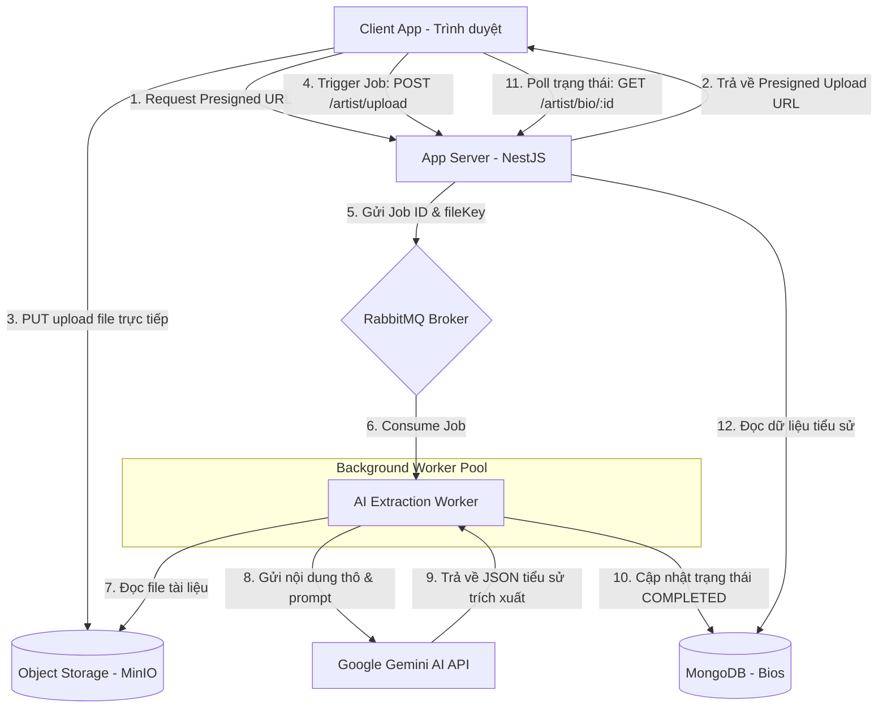

# Đặc tả: Hệ thống Trích xuất Thông tin Nghệ sĩ bằng AI (ai-extraction.md)

Tài liệu đặc tả kiến trúc xử lý tài liệu phi cấu trúc, hàng đợi tin nhắn (Message Queue), tích hợp Gemini AI Model và quy trình xuất bản tiểu sử nghệ sĩ của hệ thống TicketBox.

---

## 1. Kiến Kiến trúc Luồng Xử lý AI & Tương tác Thành phần

Việc trích xuất thông tin nghệ sĩ từ các tài liệu giới thiệu (PDF, DOCX) là một tác vụ nặng về tính toán (I/O & CPU) và phụ thuộc vào API bên thứ ba (Google Gemini API). Hệ thống sử dụng kiến trúc **Xử lý Bất đồng bộ dựa trên Hàng đợi (Message Queue-based Asynchronous Processing)** kết hợp **Tải trực tiếp lên Object Storage (MinIO Presigned URL)** để tránh làm nghẽn luồng xử lý chính.



### Các thành phần chính và nhiệm vụ:
1. **MinIO Object Storage**: Lưu trữ các file tài liệu giới thiệu thô (PDF, DOCX). Việc sử dụng Presigned URL cho phép client tải file trực tiếp lên MinIO, giảm tải băng thông và RAM cho App Server.
2. **RabbitMQ Broker**: Quản lý hàng đợi công việc (`pdf-uploaded`). Đảm bảo các job được phân phối tuần tự và kiểm soát lưu lượng gọi sang API Gemini.
3. **AI Extraction Worker**: Tiến trình nền chạy độc lập để phân tích cú pháp tài liệu (sử dụng `pdf-parse`), gọi API Gemini AI và lưu trữ kết quả.
4. **Google Gemini API (Model: gemini-2.5-flash)**: Phân tích tài liệu phi cấu trúc và chuyển đổi thành cấu trúc JSON chuẩn hóa (Short Bio, Medium Bio, SEO Bio, Milestones, Awards).
5. **MongoDB**: Cơ sở dữ liệu tài liệu (Document Database) lưu trữ kết quả tiểu sử trích xuất và trạng thái Job.

---

## 2. Thiết kế Cơ sở Dữ liệu & Schema

### Đề xuất lựa chọn Database
- **MongoDB (NoSQL - Document Store)**: Là sự lựa chọn tối ưu cho dữ liệu tiểu sử nghệ sĩ. Vì thông tin tiểu sử nghệ sĩ sau khi trích xuất hoặc nhập tay chứa nhiều trường dữ liệu phức tạp, mảng lồng nhau (danh sách giải thưởng, dòng thời gian sự nghiệp, danh sách album) và có cấu trúc không đồng nhất giữa các nghệ sĩ khác nhau. MongoDB cho phép lưu trữ dưới dạng document JSON tự nhiên, dễ dàng truy vấn và cập nhật động mà không cần chạy các câu lệnh migration schema phức tạp.

### Schema Entity `ArtistBiography` (MongoDB - Mongoose)
```typescript
const ArtistBiographySchema = new Schema({
  concertId: { type: Number, required: true, unique: true, index: true },
  artistName: { type: String, required: true },
  stageName: { type: String },
  category: { type: String, default: 'Singer' }, // Singer, Band, Rapper, DJ, etc.
  genres: [{ type: String }],
  country: { type: String },
  avatarUrl: { type: String },
  
  // Dữ liệu nội dung tiểu sử nghệ sĩ
  shortBio: { type: String },
  mediumBio: { type: String },
  seoBio: { type: String },
  
  // Mảng lồng nhau phức tạp
  timeline: [{
    year: { type: String },
    detail: { type: String }
  }],
  
  awards: [{
    name: { type: String },
    year: { type: String },
    organization: { type: String }
  }],
  
  // Trạng thái Job và Phê duyệt
  status: {
    type: String,
    enum: ['PENDING', 'EXTRACTING', 'SUMMARIZING', 'COMPLETED', 'APPROVED', 'FAILED'],
    default: 'PENDING'
  },
  errorMessage: { type: String },
  
  createdAt: { type: Date, default: Date.now },
  updatedAt: { type: Date, default: Date.now }
});
```

---

## 3. Khả năng Chịu lỗi & Xử lý sự cố (Fault Tolerance & Mitigation)

1. **Gemini API bị Rate Limit (Lỗi 429)**:
   - **Cách xử lý**: AI Worker sử dụng thuật toán **Retry với Exponential Backoff** (thử lại với thời gian chờ tăng dần) khi gọi API Gemini. Nếu vượt quá số lần thử lại tối đa (ví dụ: 5 lần), Job sẽ được đánh dấu trạng thái `FAILED` kèm mã lỗi chi tiết để ban tổ chức biết và có thể nhấn nút "Thử lại" trên giao diện.
2. **AI Worker bị crash đột ngột khi đang xử lý**:
   - **Cách xử lý**: Hệ thống sử dụng cơ chế **RabbitMQ Manual Acknowledgment (Xác nhận thủ công)**. Tin nhắn (Job) chỉ được xóa khỏi hàng đợi RabbitMQ khi worker đã xử lý hoàn tất và lưu thành công vào MongoDB. Nếu worker bị sập giữa chừng, kết nối TCP bị ngắt, RabbitMQ sẽ tự động đẩy tin nhắn đó trở lại hàng đợi (Re-queue) để worker khác hoặc worker vừa khởi động lại tiếp quản xử lý tiếp.
3. **RabbitMQ Broker bị sập**:
   - **Cách xử lý**: File tài liệu vẫn nằm an toàn trên MinIO. Server NestJS sẽ lưu thông tin Job vào MongoDB với trạng thái `PENDING`. Khi RabbitMQ hoạt động trở lại, một tiến trình rà soát định kỳ (Cron Job) trên server sẽ tự động quét các Job đang ở trạng thái `PENDING` và đẩy lại vào hàng đợi để tiếp tục trích xuất.
