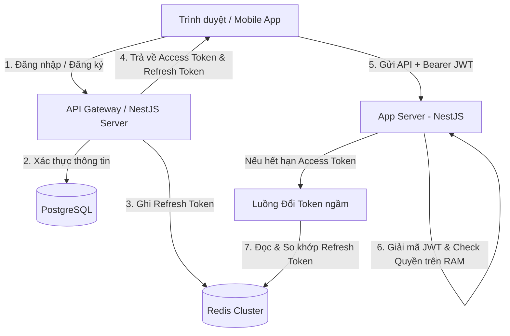

# Đặc tả: Hệ thống Xác thực & Phân quyền (auth.md)

Tài liệu đặc tả kiến trúc bảo mật, luồng xác thực (Authentication), và kiểm soát truy cập dựa trên vai trò (RBAC - Role-Based Access Control) của hệ thống TicketBox.

---

## 1. Kiến trúc Tổng thể Hệ thống Xác thực

Hệ thống áp dụng kiến trúc **Stateless JWT** kết hợp **Stateful Session Store (Redis Cache-Aside)** để tối ưu hiệu năng và bảo vệ cơ sở dữ liệu gốc trước bão tải xác thực lớn (80.000+ người dùng đồng thời).



### Các thành phần chính và nhiệm vụ:
1. **NestJS App Server (Stateless)**: Nhận request, thực hiện xác thực và phân quyền ngay trên RAM bằng cách giải mã chữ ký JWT mà không truy vấn database.
2. **PostgreSQL**: Lưu trữ lâu dài thông tin tài khoản người dùng (`User`), mật khẩu băm (bcrypt) và vai trò mặc định.
3. **Redis Cluster (In-Memory)**: Lưu trữ Refresh Token với TTL (7 ngày) và danh sách đen (Blacklist JTI) của các token đã bị thu hồi (đăng xuất). Hỗ trợ cơ chế Grace Period (Thời gian ân hạn 30s) để ngăn ngừa xung đột phiên đổi token đồng thời.

---

## 2. Mô hình Phân quyền Hệ thống (RBAC Model)

Hệ thống sử dụng cơ chế **Role-Based Access Control (RBAC)** kết hợp **Permission-Based Access Control** để tăng tính linh hoạt và bảo mật.

### Các vai trò người dùng (Roles)
Hệ thống rút gọn từ 4 vai trò xuống **3 vai trò doanh nghiệp chính**:
1. **USER (Khán giả)**: Người mua vé.
2. **ORGANIZER (Ban tổ chức)**: Người quản lý sự kiện, điều phối nghệ sĩ, phê duyệt tiểu sử, xem lịch sử và quản lý nhân sự soát vé.
3. **CHECKIN_STAFF (Nhân sự soát vé)**: Nhân sự tại cổng sự kiện thực hiện công tác quét mã và soát vé.

### Bảng phân phối quyền hạn (Permissions Matrix)

| Chức năng / Endpoint | USER | CHECKIN_STAFF | ORGANIZER | Permission Key |
| :--- | :---: | :---: | :---: | :---: |
| Đăng ký, Đăng nhập, Xem sự kiện, Mua vé | ✓ | ✓ | ✓ | *Public / Authenticated* |
| Tải tài liệu nghệ sĩ (PDF/DOCX) để AI trích xuất | ✗ | ✗ | ✓ | `AI_BIO_UPLOAD` |
| Tạo / Phê duyệt / Xuất bản tiểu sử nghệ sĩ | ✗ | ✗ | ✓ | `AI_BIO_UPLOAD` |
| Quét mã vé tại cổng (Verify QR Online/Offline) | ✗ | ✓ | ✓ | `CHECKIN_SCAN` |
| Xem lịch sử soát vé tổng hợp (Checkin Logs) | ✗ | ✗ | ✓ | `CHECKIN_VIEW_HISTORY` |

### Cơ chế kiểm tra quyền truy cập (Access Control Verification)

Hệ thống tiến hành xác thực và phân quyền qua 3 cấp độ phòng vệ:

1. **API Endpoint (NestJS Guards)**:
   - Các API nhạy cảm được bảo vệ bởi bộ đôi Guard: `JwtAuthGuard` (xác thực chữ ký JWT) và `PermissionsGuard` (kiểm tra quyền hạn).
   - Sử dụng decorator `@Permissions('CHECKIN_SCAN')` để khai báo quyền yêu cầu trực tiếp trên controller handler.
   ```typescript
   @Post('verify')
   @UseGuards(JwtAuthGuard, PermissionsGuard)
   @Permissions('CHECKIN_SCAN')
   async verify(@Body() dto: VerifyTicketDto) { ... }
   ```
   - `PermissionsGuard` đọc vai trò từ JWT payload, ánh xạ sang mảng permissions tĩnh từ cấu hình bộ nhớ RAM (`ROLE_PERMISSIONS`) và kiểm tra xem vai trò đó có sở hữu permission cần thiết hay không.

2. **Giao diện Client (React Routing & Render Guards)**:
   - **Tuyến đường bảo vệ (Route Guards)**: Các tuyến đường như `/organizer/*` và `/checkin` kiểm tra thuộc tính `user.role` từ `AuthContext`. Nếu không khớp, client hiển thị cảnh báo và chuyển hướng ngay lập tức về trang chủ `/`.
   - **Hiển thị có điều kiện (Conditional Rendering)**: Dropdown công cụ "Star Studio" trên Header ẩn/hiển thị các chức năng tùy thuộc vào vai trò:
     - `ORGANIZER`: Thấy liên kết tới **Organizer Center** và **Duyệt tiểu sử (AI Bio)**.
     - `CHECKIN_STAFF`: Chỉ thấy liên kết tới **Soát vé (Check-in)**.
     - `USER`: Không hiển thị Star Studio.

---

## 3. Thiết kế Cơ sở Dữ liệu & Schema

### Thiết kế Loại Database
- **PostgreSQL**: Được lựa chọn để lưu trữ thông tin tài khoản người dùng (`User`). Vì thông tin người dùng yêu cầu tính nhất quán dữ liệu cực cao (ACID), có các mối quan hệ chặt chẽ với vé, hóa đơn thanh toán và thông tin giao dịch tài chính.
- **Redis**: Được lựa chọn để lưu trữ các Refresh Token và Blacklist JTI vì yêu cầu thời gian đọc/ghi dưới 1ms, chịu tải hàng vạn request xác thực đồng thời mà không nghẽn cổ chai.

### Schema Entity `User` (PostgreSQL - TypeORM)
```typescript
@Entity('users')
export class User {
  @PrimaryGeneratedColumn('uuid')
  id: string;

  @Column({ unique: true })
  email: string;

  @Column({ name: 'password_hash' })
  passwordHash: string;

  @Column({
    type: 'varchar',
    length: 20,
    default: 'USER'
  })
  role: 'USER' | 'ORGANIZER' | 'CHECKIN_STAFF';

  @Column({
    type: 'varchar',
    length: 20,
    default: 'ACTIVE'
  })
  status: 'ACTIVE' | 'LOCKED';

  @CreateDateColumn({ name: 'created_at' })
  createdAt: Date;

  @UpdateDateColumn({ name: 'updated_at' })
  updatedAt: Date;
}
```

---

## 4. Khả năng Chịu lỗi & Bán kính Ảnh hưởng (Fault Tolerance & Blast Radius)

| Lỗi xảy ra | Bán kính ảnh hưởng | Cách hệ thống phản ứng (Fault Tolerance) |
| :--- | :--- | :--- |
| **PostgreSQL gặp sự cố** | Toàn bộ luồng đăng ký, đăng nhập và thanh toán bị ngắt quãng. | Người dùng đã đăng nhập vẫn có thể sử dụng Access Token (JWT) còn hạn để truy cập tài nguyên tĩnh và thực hiện soát vé online (nếu vé đã được ghi nhận trong cache). |
| **Redis Auth Node bị sập** | Luồng đổi token ngầm (Refresh Token) bị lỗi hoàn toàn. | Hệ thống áp dụng cơ chế *Graceful Degradation* (Chấp nhận hạ cấp dịch vụ): Yêu cầu người dùng đăng nhập lại thay vì fallback xuống PostgreSQL làm sập DB. Luồng soát vé ngoại tuyến không bị ảnh hưởng. |
| **Hệ thống AI Model (Gemini) bị lỗi/nghẽn** | Luồng tự động trích xuất thông tin nghệ sĩ bị dừng hoạt động. | Hệ thống báo lỗi xử lý tài liệu nhưng **luồng tạo thủ công (Manual) tiểu sử nghệ sĩ vẫn hoạt động bình thường**, đảm bảo ban tổ chức vẫn có thể vận hành sự kiện. |
| **RabbitMQ bị ngắt kết nối** | Các công việc xử lý ngầm (import VIP guest CSV, sinh AI bio) bị trì hoãn. | Các request được lưu trữ an toàn trong hàng đợi cục bộ hoặc trả về trạng thái PENDING chờ RabbitMQ phục hồi để worker tự động xử lý tiếp mà không làm sập giao diện web. |
