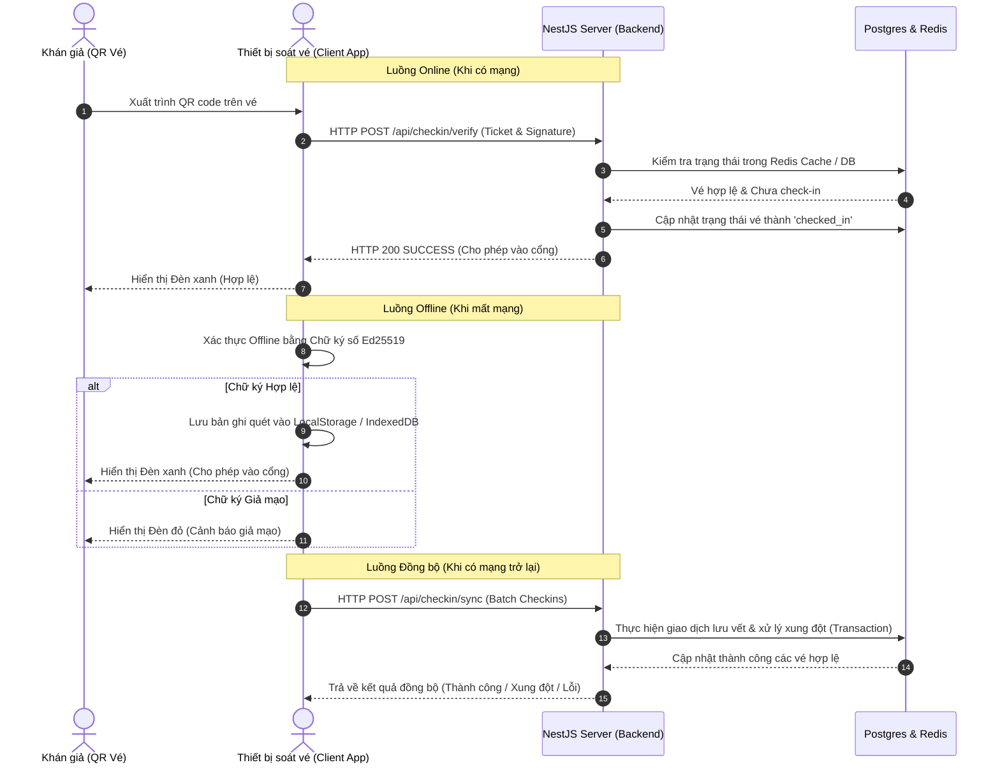

# Đặc tả: Kiến trúc Soát vé & Luồng Soát vé Ngoại tuyến (checkin.md)

Tài liệu đặc tả kiến trúc, thuật toán kiểm thử chữ ký số, luồng soát vé ngoại tuyến (Offline Check-in) khi mất mạng và cơ chế đồng bộ hóa dữ liệu (Re-synchronization) của hệ thống TicketBox.

---

## 1. Kiến trúc Luồng Soát vé & Tương tác Thành phần

Quy trình soát vé tại sự kiện đòi hỏi độ trễ cực thấp (< 200ms) để giải tỏa hàng nghìn khán giả tại các cổng kiểm soát cùng lúc. Hệ thống sử dụng mô hình kết hợp **Online/Offline** thông tin kiểm soát vé thông qua chữ ký mật mã Ed25519.



---

## 2. Luồng Soát vé Ngoại tuyến & Đồng bộ lại (Offline & Sync Flow)

### Thuật toán xác thực Offline bằng Chữ ký số (Ed25519)
Để soát vé không cần mạng mà vẫn đảm bảo tính an toàn chống làm giả, hệ thống áp dụng kỹ thuật mật mã khóa bất đối xứng:
- **Tại thời điểm mua vé**: Server ký một thông điệp chứa các thuộc tính vé bằng **Khóa bí mật (Private Key)**:
  $$\text{Message} = \text{ticketId} + \text{concertId} + \text{seatInfo} + \text{issuedAt}$$
  Chữ ký số kết quả (`signature`) được nhúng trực tiếp vào QR Code của vé.
- **Tại thiết bị soát vé di động**: Ứng dụng client được nạp sẵn **Khóa công khai (Public Key)** của máy chủ. Khi quét vé offline, client giải mã thông điệp và tự xác thực chữ ký bằng Khóa công khai. Quá trình này diễn ra hoàn toàn trên RAM thiết bị mà không cần gọi API.

### Quy trình xử lý chi tiết luồng Offline & Sync

#### Bước 1: Quét và Xác thực Ngoại tuyến (Gate Entry)
1. Nhân sự soát vé bật chế độ "Offline Mode" trên ứng dụng gate console.
2. Quét QR code từ vé của khán giả để lấy các thông tin: `ticketId`, `concertId`, `seatInfo`, `issuedAt` và `signature`.
3. Client kiểm tra chữ ký số Ed25519 bằng Khóa công khai lưu trong app:
   - **Thất bại**: Cảnh báo vé giả mạo ngay lập tức.
   - **Thành công**: Kiểm tra xem `ticketId` này đã có trong danh sách bộ nhớ tạm `offlineScans` của thiết bị chưa (chống gian lận quay vòng vé qua cùng một cổng).
4. Bản ghi soát vé được lưu trữ vào bộ nhớ LocalStorage / IndexedDB dưới dạng:
   ```json
   {
     "ticketId": "9b1deb4d-3b7d-4bad-9bdd-2b0d7b3dcb6d",
     "concertId": "1",
     "seatInfo": "SVIP-A-12",
     "scannedAt": "2026-07-12T01:45:00Z",
     "status": "pending_sync"
   }
   ```

#### Bước 2: Đồng bộ hóa dữ liệu (Re-synchronization)
Khi có kết nối mạng trở lại, nhân viên nhấn nút **Đồng bộ hóa (Sync)**:
1. Client đóng gói toàn bộ các bản ghi quét trong LocalStorage gửi lên API `/api/checkin/sync` dạng Batch Request.
2. Server tiếp nhận, mở một Database Transaction và xử lý tuần tự từng bản ghi:
   - **Trường hợp Vé Hợp lệ & Chưa từng check-in**: Server cập nhật trạng thái vé trong PostgreSQL thành `checked_in`, đồng thời cập nhật cache Redis và ghi nhận log thành công.
   - **Trường hợp Xung đột (Conflict - Vé đã quét online trước đó hoặc quét tại cổng khác)**: Server ghi nhận log quét với trạng thái `CONFLICT`, không thay đổi dữ liệu của vé đã được check-in, nhằm lưu vết gian lận của người dùng để hậu kiểm.
3. Server trả về kết quả chi tiết của từng vé trong lô đồng bộ (ví dụ: thành công 98 vé, xung đột 2 vé). Client cập nhật giao diện, xóa các vé thành công khỏi LocalStorage và hiển thị danh sách các vé bị xung đột để Organizer xử lý thủ công.

---

## 3. Thiết kế Cơ sở Dữ liệu & Schema

### Đề xuất lựa chọn Database
- **PostgreSQL (SQL)**: Lưu trữ thông tin cốt lõi của Vé (`Ticket`) để đảm bảo tính toàn vẹn tham chiếu với hóa đơn mua vé và chỗ ngồi.
- **Redis (In-Memory)**: Lưu trữ tạm thời trạng thái soát vé thời gian thực để hỗ trợ luồng soát vé Online phản hồi < 5ms.
- **MongoDB (NoSQL)**: Lưu trữ lịch sử soát vé chi tiết (`CheckinLog`). Vì lịch sử soát vé dạng log có tần suất ghi cực cao tại thời điểm diễn ra sự kiện, cấu trúc log có thể mở rộng (thêm thông tin thiết bị, vị trí cổng, mã lỗi thiết bị) và không yêu cầu tính nhất quán giao dịch nghiêm ngặt.

### Thiết kế Schema các Entity quan trọng

#### 1. Entity `Ticket` (PostgreSQL - Relational)
```typescript
@Entity('tickets')
export class Ticket {
  @PrimaryGeneratedColumn('uuid')
  id: string;

  @Column({ name: 'concert_id' })
  concertId: number;

  @Column({ name: 'seat_info' })
  seatInfo: string;

  @Column({
    type: 'varchar',
    length: 20,
    default: 'valid' // 'valid' | 'checked_in' | 'refunded'
  })
  status: string;

  @Column({ name: 'signature', type: 'text' })
  signature: string;

  @Column({ name: 'issued_at', type: 'bigint' })
  issuedAt: number;

  @UpdateDateColumn({ name: 'updated_at' })
  updatedAt: Date;
}
```

#### 2. Schema `CheckinLog` (MongoDB - Document Store)
```typescript
const CheckinLogSchema = new Schema({
  ticketId: { type: String, required: true, index: true },
  concertId: { type: String, required: true, index: true },
  seatInfo: { type: String, required: true },
  deviceId: { type: String, required: true },
  scannedAt: { type: Date, default: Date.now },
  syncStatus: {
    type: String,
    enum: ['SUCCESS', 'CONFLICT', 'FAILED'],
    required: true
  },
  isOffline: { type: Boolean, default: false },
  errorMessage: { type: String, required: false }
});
```

---

## 4. Kịch bản Xử lý Lỗi giữa chừng trong quá trình Đồng bộ

1. **Mất mạng khi đang gửi lô đồng bộ**:
   - Client sử dụng cơ chế an toàn: Chỉ xóa dữ liệu soát vé khỏi LocalStorage khi và chỉ khi nhận được phản hồi HTTP 200/201 kèm xác nhận đồng bộ thành công của ID vé tương ứng từ Server.
   - Nếu kết nối bị đứt giữa chừng, client giữ nguyên dữ liệu trong LocalStorage và sẽ thử đồng bộ lại ở lượt tiếp theo.
2. **Server bị sập khi đang xử lý giao dịch đồng bộ**:
   - Sử dụng cơ chế Transaction ở tầng cơ sở dữ liệu. Mọi thay đổi của một vé bị lỗi trong lô sẽ được Rollback hoàn toàn, không dẫn đến tình trạng sai lệch trạng thái nửa chừng trong database.
