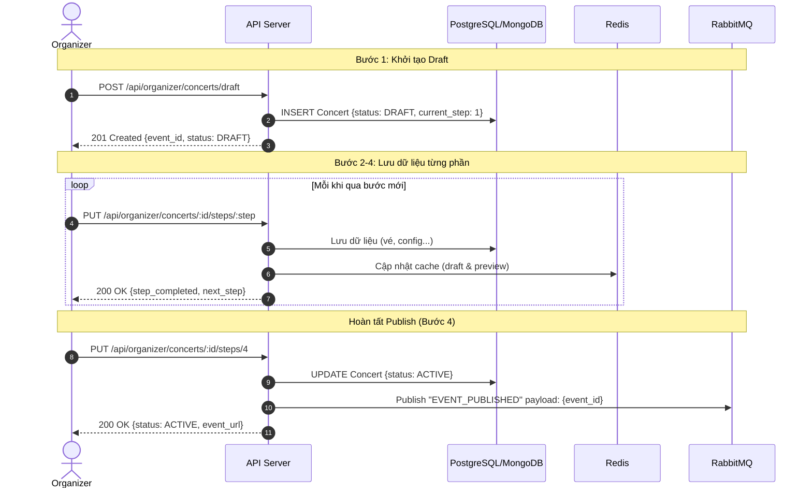
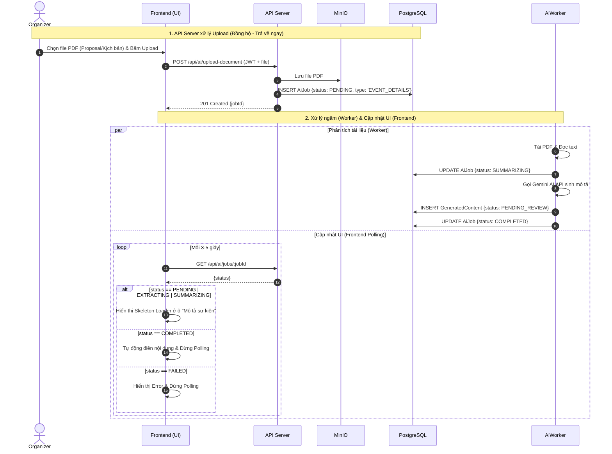
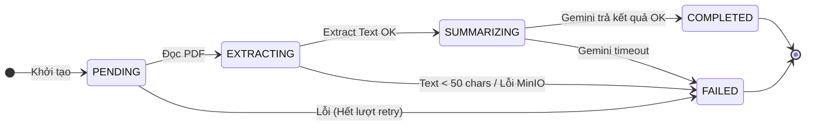

# Đặc tả: Tạo Sự Kiện và Tích Hợp AI Tạo Thông Tin Chi Tiết

## Mô tả

Tính năng gồm **hai luồng độc lập** phối hợp với nhau để tạo ra một sự kiện hoàn chỉnh tích hợp thông tin chi tiết sự kiện (event description, SEO keywords...) được sinh bởi AI. Việc bóc tách này đảm bảo API tạo sự kiện không bao giờ bị nghẽn (block) bởi thời gian chờ AI phân tích tài liệu.

- **Luồng 1 (Tạo sự kiện):** Ban tổ chức tạo sự kiện qua giao diện wizard 4 bước.
- **Luồng 2 (AI Phân Tích Thông Tin):** Quá trình đọc PDF (tài liệu sự kiện, proposal), gọi AI sinh nội dung chi tiết, và lưu kết quả được thực hiện ngầm bởi Background Worker. Frontend sử dụng kỹ thuật Polling kết hợp Skeleton Loader để tự động điền vào form khi hoàn tất.

---

## Luồng chính

### Luồng 1: Tạo Sự Kiện (4-Step Wizard)

### Luồng 2: Upload Tài Liệu & AI Sinh Thông Tin Chi Tiết (Bất Đồng Bộ)

*Lưu ý: Luồng dưới đây đã được đơn giản hóa để mô tả tổng quan sự phối hợp giữa Frontend, API và Worker.*

### Cơ chế Skeleton Loader: Hiện tại vs Ý tưởng thiết kế

Để Frontend biết khi nào cần hiển thị hiệu ứng đang tải (Skeleton Loader), hệ thống dựa vào `status` của `AiJob`.

| Tiêu chí | Code hiện tại đang hoạt động | Ý tưởng thiết kế (Mục tiêu) |
|---|---|---|
| **Quản lý Polling** | Frontend tự viết `setInterval` thủ công trong component để gọi API liên tục. | Sử dụng một custom hook `usePollAiJob(jobId, intervalMs)` tái sử dụng được, tự động quản lý vòng đời polling. |
| **Giao diện chờ (Loading)**| Dùng thẻ loading cơ bản hoặc text "Đang xử lý...". Chưa chuẩn hóa. | Tạo component `<SkeletonCard>` dùng CSS animation `shimmer` (nhấp nháy) để tạo cảm giác mượt mà và chuyên nghiệp. |
| **Hiển thị lỗi** | Alert error đơn giản. | Component `<ErrorState>` chuyên dụng kèm nút "Thử lại". |

---

## Kịch bản lỗi

| # | Tình huống | Hành vi Worker / Hệ thống | Kết quả |
| --- | --- | --- | --- |
| E-1 | PDF extract ra text < 50 ký tự | Throw error → `handleJobError` | `AiJob.status = FAILED`, đẩy vào Dead Letter Queue (DLQ) |
| E-2 | Gemini API lỗi / trả JSON sai | Auto-fallback sang **Mock AI Response** | Nội dung chi tiết vẫn được tạo từ dữ liệu Mock; ghi log cảnh báo |
| E-3 | Retry lần 1–2 (bất kỳ lỗi nào) | ACK message cũ, publish lại sau Exponential Backoff (4s, 8s) | `AiJob.retryCount` tăng; `status = PENDING` |
| E-4 | Retry lần 3 (max reached) | Không retry thêm, đẩy vào DLQ | `AiJob.status = FAILED`, ngừng xử lý |
| E-5 | Slug trùng khi tạo event Step 3 | API check trùng lặp và trả `409 Conflict` | Frontend báo lỗi, yêu cầu chọn slug khác |

---

## Ràng buộc

* **Cấu hình Queue:** Queue `pdf-uploaded` cấu hình `prefetch = 1` để Worker xử lý tuần tự, chống quá tải bộ nhớ.
* **Retry Policy:** Retry tối đa 3 lần với thời gian chờ tăng dần (Exponential backoff: 4s, 8s).
* **Phân quyền:** Cần có quyền `AI_DOCUMENT_UPLOAD` trong token JWT.

---

## Tiêu chí chấp nhận

* **AC-1:** Upload API `POST /api/ai/upload-document` phản hồi `HTTP 201` dưới 500ms ngay cả với file 20MB.
* **AC-2:** Tạo sự kiện 4 bước hoàn chỉnh mà không cần upload PDF (bỏ qua luồng AI) thì Sự kiện vẫn phải được tạo và `ACTIVE` thành công.
* **AC-3:** Frontend hiển thị Skeleton Loader ở ô văn bản khi job đang xử lý (Status `PENDING`, `EXTRACTING`, `SUMMARIZING`).
* **AC-4:** Khi Gemini API lỗi, thông tin chi tiết sự kiện vẫn được sinh ra dựa trên Mock Data thay vì báo lỗi toàn bộ hệ thống.
