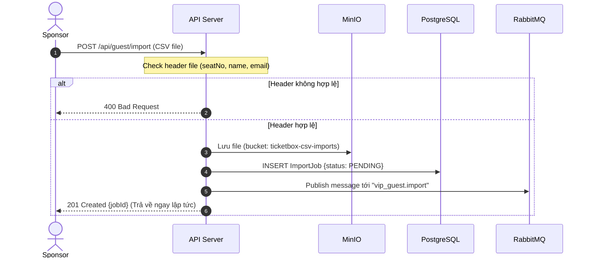
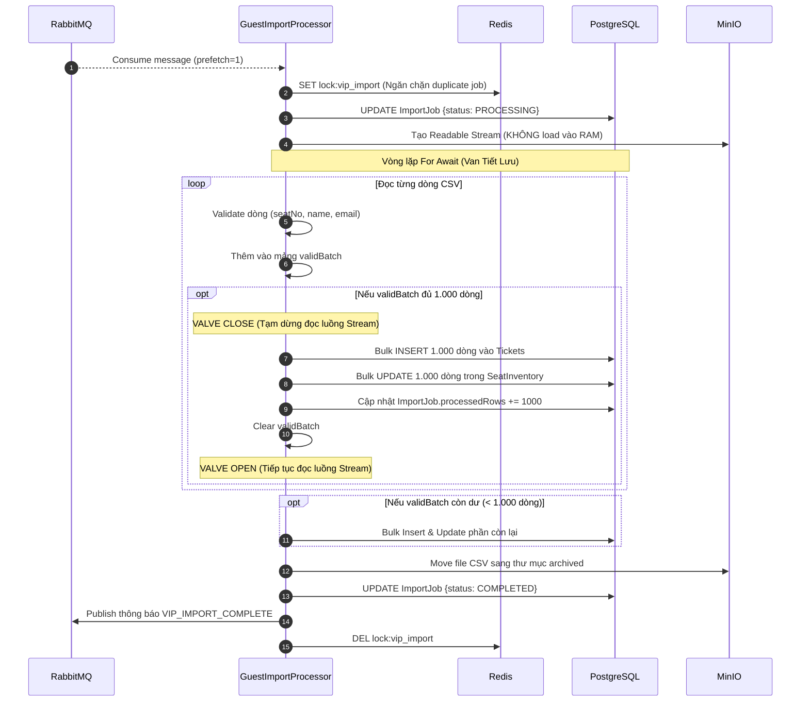
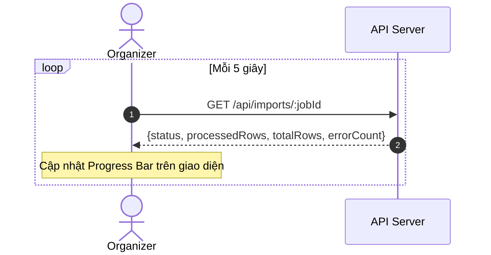
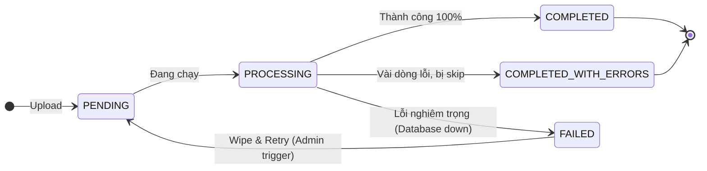

# Đặc tả: Import Danh Sách Khách Mời VIP từ CSV

## Mô tả

Tính năng cho phép Nhà Tài Trợ (Sponsor) import danh sách khách mời VIP vào hệ thống thông qua file CSV. Mục tiêu kỹ thuật cốt lõi là xử lý được file CSV có **hàng trăm nghìn dòng** mà **không gây tràn bộ nhớ RAM** và **không làm quá tải Database**.

### Giải pháp: Van Tiết Lưu (Stream Throttle)

Thay vì đọc toàn bộ file vào RAM rồi insert một lần, hệ thống sử dụng mô hình **Stream + Async Iterator + Batch Bulk Insert** để kiểm soát lưu lượng dữ liệu chạy qua Worker:

- File CSV được lưu vào **MinIO** (không xử lý trực tiếp trong RAM của API server)
- Một **RabbitMQ message** nhỏ gọi Worker xử lý file
- Worker **stream** file từ MinIO, đọc từng dòng qua `csv-parser` và `for await`
- Cứ đủ **1.000 dòng hợp lệ** thì **dừng stream** (`pause`), thực hiện **1 lần Bulk INSERT** vào DB, xong mới **tiếp tục** (`resume`)

RAM được tiêu thụ tối đa chỉ bằng kích thước của 1 batch (1.000 dòng), bất kể file lớn đến đâu.

### Các đối tượng tham gia

| Vai trò | Hành động |
|---|---|
| **Sponsor** | Upload file CSV chứa danh sách ghế + thông tin khách |
| **API Server** | Nhận file, lưu MinIO, tạo `ImportJob`, đẩy message vào RabbitMQ, trả `201` ngay |
| **GuestImportProcessor** | Worker tiêu thụ message, stream CSV, bulk insert vào DB |
| **Organizer** | Theo dõi tiến độ import qua `GET /api/imports/:jobId` |

### Cấu trúc CSV bắt buộc

```csv
seatNo,name,email
A-1,Nguyen Van A,a@example.com
A-2,Tran Thi B,b@example.com
```

| Cột | Bắt buộc | Mô tả |
|---|---|---|
| `seatNo` | ✅ | Format: `ROW-NUMBER` (ví dụ: `A-1`, `B-12`) |
| `name` | ✅ | Tên khách mời |
| `email` | ✅ | Email khách mời |

---

## Luồng chính

### Phase 1: Upload và Dispatch



### Phase 2: Stream Processing (Van Tiết Lưu)



### Theo dõi tiến độ từ phía Organizer



---

## Kịch bản lỗi

### Lỗi 1: Header CSV không hợp lệ (Pre-flight check)

- **Kích hoạt:** File CSV thiếu cột `seatNo`, `name`, hoặc `email` (kiểm tra từ header row đầu tiên)
- **Xử lý hiện tại:** Validation header xảy ra sau khi stream bắt đầu — Worker sẽ có lỗi `validateRow` liên tục cho toàn bộ file.
- **Thiết kế mục tiêu:** API Server đọc **chỉ ~200 bytes đầu tiên** của stream từ MinIO để check header, trả `400 Bad Request` ngay lập tức trước khi lưu file vào MinIO và đẩy vào queue.

### Lỗi 2: Row data không hợp lệ (Skip-and-Continue)

- **Kích hoạt:** Dòng CSV thiếu field, hoặc `seatNo` sai format (không phải `ROW-NUMBER`)
- **Xử lý hiện tại (đã implement):** Row bị skip, push vào `errors[]`. Các dòng hợp lệ khác tiếp tục xử lý bình thường.
- **Kết quả:** `ImportJob.status = COMPLETED_WITH_ERRORS`, `errorDetails` chứa danh sách lỗi kèm row number.

### Lỗi 3: Lỗi không thể phục hồi (Wipe and Retry)



> **Đã làm được (hiện tại):** Khi Worker gặp lỗi unrecoverable (MinIO down, DB crash hoàn toàn), hệ thống:
> 1. Gắn tag `status=error` cho MinIO object.
> 2. Update `ImportJob.status = FAILED`.
> 3. `channel.nack` đẩy message vào **Dead Letter Queue (DLQ)**.
> 4. Xóa Redis lock.
>
> **Thiết kế mục tiêu (Wipe and Retry):**
> Thêm endpoint để Organizer có thể trigger chạy lại:
> `POST /api/imports/:jobId/retry`
> 1. WIPE: Xóa toàn bộ dữ liệu đã insert dở dang của job này (`DELETE FROM tickets...`).
> 2. RESET: Đặt lại `ImportJob.status = PENDING`.
> 3. RE-ENQUEUE: Publish lại message vào queue để đọc file lại từ đầu.

### Lỗi 4: Duplicate job cùng show + sponsor (Race condition)

- **Kích hoạt:** 2 sponsor upload đồng thời 2 file cho cùng `showId + sponsorId`
- **Xử lý hiện tại (đã implement):** Redis lock `NX` với TTL 30 phút. Worker thứ 2 không acquire được lock → `NACK (requeue=true)` → message quay lại queue, chờ lock được giải phóng.

---

## Ràng buộc

### Cấu hình hệ thống
| Tham số | Giá trị | Ghi chú |
|---|---|---|
| MinIO bucket | `ticketbox-csv-imports` | Object key: `{showId}/{sponsorId}_{ts}.csv` |
| RabbitMQ queue | `vip_guest.import` | Consumer: `GuestImportProcessor` |
| Worker prefetch | `1` | 1 file tại 1 thời điểm — không overlap |
| `BATCH_SIZE` | `1.000 dòng` | Cân bằng giữa số round-trip DB và RAM usage |
| Redis lock TTL | `1800 giây` | Key: `lock:vip_import:{showId}:{sponsorId}` |

### Bộ nhớ (Memory Safety)
- **Tại mọi thời điểm**, Worker chỉ giữ tối đa `BATCH_SIZE = 1.000 rows` trong RAM.
- `for await` tự động back-pressure stream: stream không emit thêm `data` khi `bulkInsertBatch()` đang `await`.
- File CSV 500MB với 1 triệu dòng → RAM Worker chỉ tăng thêm ~vài MB.

---

## Tiêu chí chấp nhận

| # | Tiêu chí | Cách kiểm tra |
|---|---|---|
| AC-1 | `POST /api/guest/import` trả về `HTTP 201` trong < **2 giây**, bất kể kích thước file CSV | Upload file CSV 50MB, đo response time |
| AC-2 | Worker xử lý file 100.000 dòng **không OOM** (RAM Worker không vượt 512MB) | Monitor process memory trong khi xử lý file lớn |
| AC-3 | `processedRows` được cập nhật sau mỗi batch — `GET /imports/:jobId` phản ánh tiến độ thực tế | Polling API trong khi Worker xử lý file lớn |
| AC-4 | Row thiếu field (`seatNo`, `name`, hoặc `email`) bị **skip** nhưng các row hợp lệ khác vẫn được insert | Upload file có 10 row hỗn hợp (valid + invalid) |
| AC-5 | Duplicate `seatNo` trong CSV được **upsert** (không gây lỗi, cập nhật thông tin mới nhất) | Upload file có 2 dòng cùng `seatNo` |
| AC-6 | 2 sponsor upload cùng `showId` đồng thời → Worker thứ 2 phải **chờ** (không xử lý song song) | Kiểm tra Redis lock; 1 job chờ cho đến khi job kia hoàn thành |
| AC-7 | Sau khi import thành công, `seat_inventory.status` của các ghế được import = `SOLD` | `SELECT status FROM seat_inventory WHERE seatNo IN (...)` |
| AC-8 | `errorDetails` chứa đúng `row number` và `seatNo` cho mỗi dòng lỗi | Import file CSV có các lỗi đã biết, so sánh `errorDetails` |
| AC-9 | **[Thiết kế mục tiêu]** `POST /imports/:jobId/retry` xóa sạch dữ liệu cũ của job và re-import thành công | Gây fail job, gọi retry endpoint, kiểm tra tickets cũ đã bị xóa và được tạo lại đúng |
| AC-10 | File CSV với header sai (thiếu cột) bị từ chối bằng `400 Bad Request` trước khi lưu MinIO | Upload file CSV không có cột `seatNo` |
